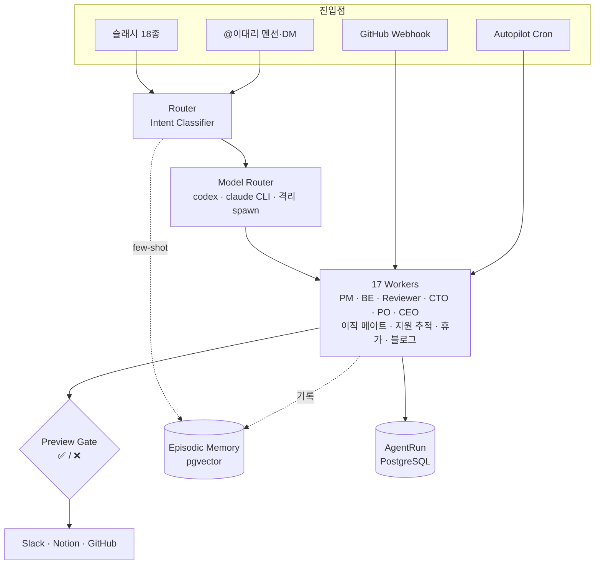

<div align="center">

# 🤖 이대리 · personal_agents

**Slack 에서 PM · BE · 리뷰어 · CTO · PO · CEO 를 1인 개발자가 부리는 멀티 에이전트 업무 자동화 봇**

수동 슬래시 · 자연어 멘션 · GitHub Webhook · 자동 Cron 을 한 백엔드로 묶는다.

[](https://github.com/JSL107/personal_agents/actions)


[무엇을 하나](#-무엇을-하나) · [아키텍처](#-아키텍처) · [만든 것](#-만든-것) · [앞으로 만들 것](#-앞으로-만들-것) · [빠른 시작](#-빠른-시작) · [인터페이스](#-인터페이스) · [설정](#-설정) · [명령어](#-명령어)

</div>

---

## ✨ 무엇을 하나

GitHub · Notion · Slack 을 연결해 **회사 롤플레이 역할**(PM · BE · Code Reviewer · CTO · PO · CEO …)과 **개인 업무**(이직 메이트 · 지원 추적 · 휴가 · 블로그)를 함께 수행하는 1인 개발자용 비서 백엔드.

| | |
|---|---|
| 🗣️ **두 가지 진입** | `/today` 슬래시 18종, 또는 `@이대리 오늘 plan 짜줘` 자연어 멘션·DM |
| 🎭 **회사 롤플레이** | 한 사람이 PM · BE · 리뷰어 · CTO · PO · CEO 역할을 LLM 워커로 분담 |
| ⚡ **자동 발화** | 출근/퇴근/주간 cron + GitHub webhook 으로 사용자 입력 없이 proactive 동작 |
| 🧠 **장기 기억** | 과거 작업을 pgvector 의미검색으로 회상해 분류·리뷰 품질 강화 |
| 🛡️ **승인 게이트** | 외부 시스템 쓰기는 항상 Slack ✅/❌ 확인 후 실행 |

> 자동화 규칙 [AGENTS.md](./AGENTS.md) · 코드 컨벤션 [CODE_RULES.md](./CODE_RULES.md)

---

## 🧩 아키텍처



레이어 구조는 도메인마다 동일한 DDD/Hexagonal:

```
src/{domain}/
  domain/         # 엔티티, Port 인터페이스, 도메인 검증
  application/    # 유스케이스
  infrastructure/ # Port 어댑터 (DB · 큐 · 외부 API)
  interface/      # Controller, DTO, 큐 Provider
src/common, src/config, src/prisma   # 공통 · env 검증 · PrismaService(Global)
prisma/schema.prisma                 # DB 단일 소스 (11 models)
```

---

## ✅ 만든 것

<table>
<tr><td width="50%" valign="top">

**🏗️ 기반**
NestJS 10 + DDD/Hexagonal · Prisma 6 + PostgreSQL · Redis/BullMQ · Slack Bolt 4(Socket Mode). **Model Router** 가 `codex`(ChatGPT) / `claude`(Claude) CLI 를 격리 환경에서 spawn(프롬프트는 stdin — `ps aux` 노출 방지). **AgentRun** 실행 기록 + EvidenceRecord 자동 추적, **Preview Gate** 가 모든 외부 쓰기를 승인 게이트로 공통 처리.

</td><td width="50%" valign="top">

**🧠 장기 기억 (Episodic Memory)**
pgvector 의미검색 + HNSW 인덱스 + time-decay 점수화(`@huggingface/transformers`, Xenova/multilingual-e5-small 384dim). **Intent Classifier** 가 유사 과거작업을 few-shot 으로 prepend 해 분류 정확도를 강화하고, **Code Reviewer** 는 reject 피드백을 negative example 로 자동 적재·학습한다.

</td></tr>
<tr><td width="50%" valign="top">

**⚡ 자동화 (Autopilot)**
선언적 "워크데이 플레이북" + 얇은 오케스트레이터가 출근(아침 PM 계획)/퇴근(PO_EVAL 회고 + worklog)/주간(Weekly · CEO · Impact · Run-Retro) cron 을 단일 엔진으로 통합. 리스크 티어(읽기 자동 발송 / 외부쓰기 PreviewGate), 다중 타깃 fan-out, digest 그룹, 멱등 + 활동 0이면 skip. 게이트는 `AUTOPILOT_OWNER_SLACK_USER_ID` 한 값.

</td><td width="50%" valign="top">

**🔀 자연어 라우터 (V3 Hierarchical Manager)**
`@이대리 …` 멘션 / DM → Intent Classifier(1 LLM call) → 17 worker dispatch → handoff chain(`AgentRun.parentId` audit). 사용자+채널당 multi-turn 메모리 5 turn / TTL 30분(Redis, 실패 시 in-memory fallback). 지시대명사("그거 분배해")로 직전 run 자동 참조해 자연어 체인 가능.

</td></tr>
</table>

**🎭 에이전트 (20종)**

- **회사 롤플레이** — PM `/today` · Work Reviewer `/worklog` · Code Reviewer `/review-pr` · BE `/be plan` · PO Shadow `/po-shadow` · Impact Reporter `/impact-report` · CTO `/assign` · PO_EVAL `/po-eval` · CEO `/ceo-review`
- **BE 자율 4종** — `/be schema`(Prisma 스키마 제안) · `/be test`(tree-sitter AST 기반 Jest 생성) · BE-SRE(CI 실패 → stack trace) · BE-FIX(PR 컨벤션) — 뒤 둘은 webhook 자동
- **체인** — `/auto-flow` PM → CTO → BE 1-shot (step 사이 사용자 confirm 안전판)
- **개인 업무** — 이직 메이트(merged PR 합성 → 역량 프로필 → 이력서/포트폴리오, JD 갭 분석) · 지원 추적 CRM(등록/상태/넛지 cron) · 휴가 `/휴가`(입사일 기반 결정론 계산) · 블로그 릴레이(Hermes `tistory-blog` 스킬 → Notion 초안)

**🔌 연동 · 자동 트리거**

- **GitHub Webhook** — issue/PR open → Impact Reporter, PR open → BE-FIX(+조건부 Code Reviewer), CI 실패 → BE-SRE, PR merge → careerLog Notion 적재, issue open → Auto-Label
- **Notion** — Daily Plan append · PR careerLog 일별 자식 페이지 누적 · 📌 reaction → to-do 적재
- **운영** — `/search-runs`(성공 run ILIKE 검색) · `/retry-run`(실패 run 재실행) · 인증/cron 실패 owner DM 알림

---

## 🔭 앞으로 만들 것

- [ ] **토론 모드** — 멀티 에이전트가 한 주제로 의견을 교환·반박하며 합의안을 도출 (현재 단일 워커 dispatch → 다자 debate 로 확장)
- [ ] **BE 자율 개발 (sandbox)** — BE worker 가 격리 sandbox 에서 `git apply --check` 로 패치를 검증한 뒤 자동 PR 까지 (Phase 2a 골격 착수 — `app.module.ts` 의 `BeSandboxApplier` 주석 참조)
- [ ] **운영 전환** — `prisma db push`(synchronize) → `prisma migrate dev` 마이그레이션 워크플로우

---

## 🚀 빠른 시작

```bash
pnpm install          # Prisma Client 생성 (DATABASE_URL 불필요)
cp .env.example .env  # 부팅 전 필수
pnpm db:up            # PostgreSQL(5434) + Redis(6381) 컨테이너 기동
pnpm db:push          # 스키마 동기화 (synchronize, 마이그레이션 파일 X)
pnpm dev              # watch 모드 기동
```

> **사전 요구사항** — Node 20+, pnpm 9+, Docker, 로그인된 `codex` CLI(ChatGPT) · `claude` CLI(Claude Max). 두 CLI 는 prompt-injection 방지를 위해 빈 임시 디렉토리 + env allowlist 로 격리 실행([cli-process.util.ts](src/model-router/infrastructure/cli-process.util.ts)).
> **검증** — `pnpm lint:check && pnpm test && pnpm build` 3중 green.

---

## 🔌 인터페이스

### 슬래시 커맨드 (18종)

| Command | 설명 | 모델 |
|---|---|:---:|
| `/today` `/worklog` `/po-shadow` `/impact-report` | 계획 · 회고 · PO 재검토 · 임팩트 보고서 | 🟢 ChatGPT |
| `/review-pr` `/be <plan\|schema\|test>` `/assign` `/po-eval` `/ceo-review` `/auto-flow` | PR 리뷰 · BE · CTO · PO · CEO · 체인 | 🟣 Claude |
| `/휴가` | 연차 계산 / 등록 / 취소 (결정론, LLM 미사용) | ⚪ — |
| `/sync-plan` `/sync-context` `/quota` `/ping` `/retry-run` `/search-runs` `/review-feedback` | 동기화 · 운영 · 검색 · 피드백 | ⚪ — |

> BE-SRE / BE-FIX 는 슬래시 없이 GitHub webhook 자동 트리거. 수동 재실행은 `/retry-run <AgentRun ID>`.

### 자연어 멘션

`@이대리 …`(채널) 또는 DM 으로 보내면 Router 가 17 worker 중 1개로 분류·dispatch (결과는 thread 답글 + `agentRunId` 푸터). **BLOG · VACATION · 이직 메이트 · 지원 추적은 자연어 전용**. 설정: Event Subscriptions 에 `app_mention` + `message.im`, Bot scope 에 `app_mentions:read` + `im:history`.

### GitHub Webhook (`POST /v1/agent/github` · `/v1/agent/trigger`)

`/github` 는 `X-Hub-Signature-256`(`GITHUB_WEBHOOK_SECRET`), `/trigger` 는 자체 HMAC(`WEBHOOK_SECRET`) 검증. `GITHUB_WEBHOOK_DEFAULT_SLACK_USER_ID` 미설정 시 200 OK 만 반환하고 자동 발화 skip(graceful).

| 이벤트 | 발화 | 추가 활성 env |
|---|---|---|
| `issues.opened` | Impact Reporter / Auto-Label | `GITHUB_ISSUE_AUTO_LABEL_ENABLED` |
| `pull_request.opened` | Impact Reporter / BE-FIX / (조건부) Code Reviewer | `GITHUB_WEBHOOK_OWNER_LOGIN` |
| `pull_request.closed` (merged) | PR careerLog → Notion | `PR_CAREERLOG_AUTO_ENABLED` + `CAREER_LOG_NOTION_PAGE_ID` |
| `check_run.completed` (failure) | BE-SRE | — |

### Autopilot cron (KST)

`AUTOPILOT_OWNER_SLACK_USER_ID` 한 값으로 전체 활성, 미설정 시 비활성(graceful).

| 시간 | 동작 |
|---|---|
| 🌅 매일 08:30 | Morning Briefing (PM `/today` 자동 계획) |
| 🌆 매일 19:00 | Daily Eval(PO_EVAL) + Worklog — digest 1메시지 |
| 📅 금 17:00 | Weekly Summary (Worklog 1주 + CEO meta) |
| 📅 월 09:00 | CEO Meta · Run-Retro (주간 실행 통계 회고) |
| 📅 토 09:00 | Impact Report (`--recent`, 본인 머지 PR 종합) |

> 스케줄/타임존 override 는 `AUTOPILOT_<ID>_SCHEDULE`/`_TIMEZONE`, 플레이북 선언은 [autopilot.playbook.ts](src/autopilot/domain/autopilot.playbook.ts).

---

## 🔧 설정

<details>
<summary><b>환경변수 (자주 만지는 키)</b></summary>

<br>

단일 source-of-truth 는 [app.config.ts](src/config/app.config.ts)(class-validator 강제). webhook/careerLog/impact 세부 옵션은 해당 파일 주석 참조.

| 키 | 필수 | 설명 |
|---|:---:|---|
| `DATABASE_URL` · `REDIS_HOST` / `REDIS_PORT` | ✅ | PostgreSQL(5434) · Redis(6381) |
| `SLACK_BOT_TOKEN` / `_APP_TOKEN` / `_SIGNING_SECRET` | ⭕ | 3개 모두 있어야 봇 활성 (Socket Mode) |
| `GITHUB_TOKEN` · `NOTION_TOKEN` / `NOTION_TASK_DB_IDS` | ⭕ | 미설정 시 해당 연동 skip |
| `CLAUDE_MODEL` · `EPISODIC_EMBED_MODEL` / `_DIM` | ❌ | Claude 모델(기본 opus) · 임베딩(기본 384dim) |
| `AUTOPILOT_OWNER_SLACK_USER_ID` · `AUTOPILOT_TARGET` | ⭕ | cron 전체 게이트 · 발송 대상(콤마 다중) |
| `*_WEBHOOK_SECRET` · `GITHUB_WEBHOOK_*` | ⭕ | webhook 검증 · 자동 발화 가드 |
| `CAREER_LOG_NOTION_PAGE_ID` · `SLACK_PUSHPIN_REACTION_NOTION_PAGE_ID` | ⭕ | Notion 적재 대상 페이지 |

**Model fallback** — Claude primary 실패 시 ChatGPT(Codex CLI) 자동 재시도. ChatGPT primary(PM/WorkReviewer/Impact/PoShadow)는 재시도 없이 즉시 실패. (Gemini fallback 은 2026-06-04 제거.)
**claude 인증** — keychain ACL 미등록 환경 우회용으로 `.env` 의 `CLAUDE_CODE_OAUTH_TOKEN`(`claude setup-token` 발급) 지원.

</details>

<details>
<summary><b>Slack 봇 최초 설정</b></summary>

<br>

1. [api.slack.com/apps](https://api.slack.com/apps) 에서 앱 생성 → **Socket Mode** 활성화 → App-Level Token(`connections:write`) = `SLACK_APP_TOKEN`
2. **OAuth & Permissions** → Bot Token Scopes 에 `commands` `chat:write` `app_mentions:read` `im:history` → install → Bot Token = `SLACK_BOT_TOKEN`
3. **Basic Information** → Signing Secret = `SLACK_SIGNING_SECRET`
4. **Slash Commands** 에 18종 등록 (또는 **App Manifest** 의 `slash_commands` 배열로 일괄 선언 후 Reinstall)
5. **Event Subscriptions** → `app_mention` + `message.im` 구독 → Reinstall
6. `.env` 채운 뒤 `pnpm dev` → `이대리 Slack 봇이 Socket Mode 로 기동되었습니다.` 로그 확인

> Socket Mode 라 Request URL 은 불필요(UI 가 요구하면 더미 값). 채널 멘션만/DM만 필요하면 해당 이벤트만 켜도 됨.

</details>

---

## 🧰 명령어

```bash
pnpm dev | start | start:prod                 # 개발 watch | 실행 | 프로덕션
pnpm db:up | db:down | db:push | db:studio     # 로컬 DB/Redis · 스키마 반영 · Studio
pnpm build | test | test:e2e | lint:check | format:check
```

> **DB 변경**: `prisma/schema.prisma` 수정 → `pnpm db:push`(synchronize, Prisma Client 자동 재생성) → 앱 재시작.

---

## 📚 참고 문서

- [자동화 규칙 (AGENTS.md)](./AGENTS.md) · [코드 규칙 (CODE_RULES.md)](./CODE_RULES.md)
- 진행 기록 [docs/superpowers/plans/](./docs/superpowers/plans/) · [과거 설계/기획 archive](./docs/archive/)
