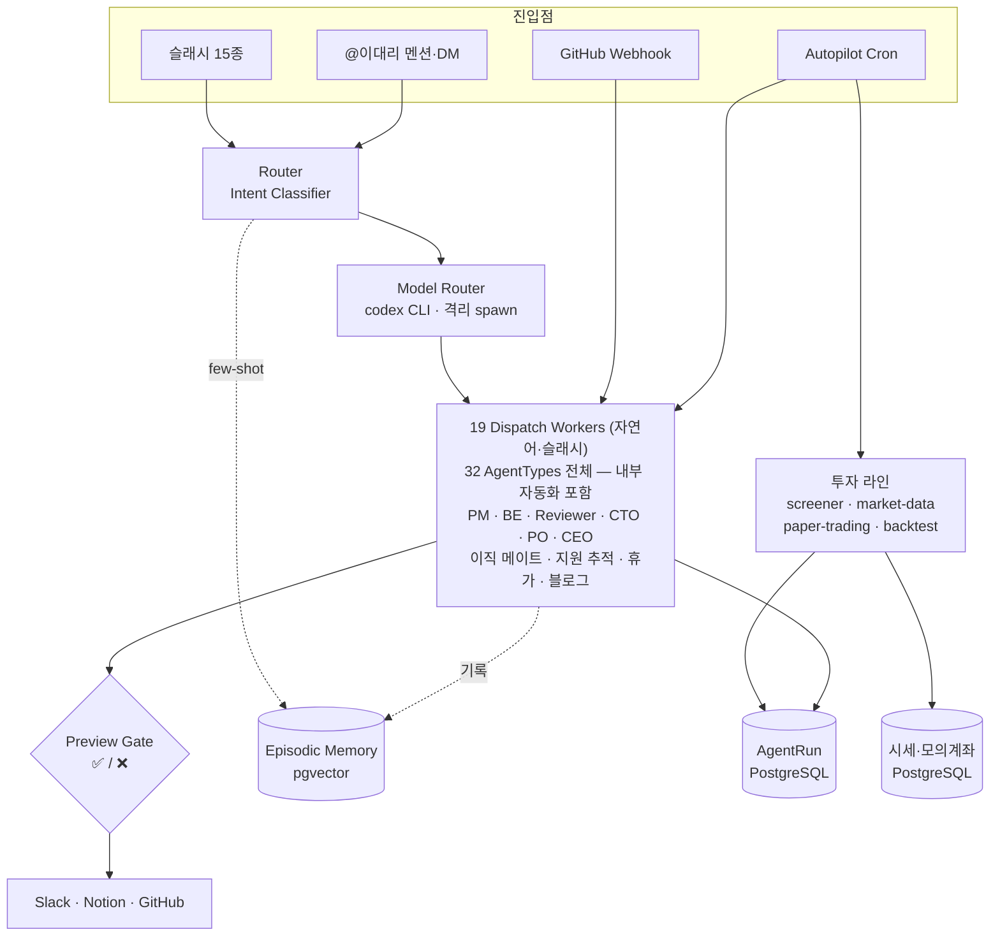

<div align="center">

# 🤖 이대리 · personal_agents

**Slack 에서 PM · BE · 리뷰어 · CTO · PO · CEO 를 1인 개발자가 부리는 멀티 에이전트 업무 자동화 봇**

수동 슬래시 · 자연어 멘션 · GitHub Webhook · 자동 Cron 을 한 백엔드로 묶는다.

[](https://github.com/JSL107/personal_agents/actions)


[무엇을 하나](#-무엇을-하나) · [아키텍처](#-아키텍처) · [만든 것](#-만든-것) · [빠른 시작](#-빠른-시작) · [인터페이스](#-인터페이스) · [설정](#-설정) · [앞으로 만들 것](#-앞으로-만들-것) · [명령어](#-명령어)

</div>

---

## ✨ 무엇을 하나

GitHub · Notion · Slack · 증권 시세를 연결해 **회사 롤플레이 역할**(PM · BE · Code Reviewer · CTO · PO · CEO …), **개인 업무**(이직 메이트 · 지원 추적 · 휴가 · 블로그), **투자 라인**(종목 감시 · 모의투자 추천·채점)을 함께 수행하는 1인 개발자용 비서 백엔드.

| | |
|---|---|
| 🗣️ **두 가지 진입** | Slack slash command 19개, 또는 `@이대리 오늘 plan 짜줘` 자연어 멘션·DM |
| 🎭 **회사 롤플레이** | 한 사람이 PM · BE · 리뷰어 · CTO · PO · CEO 역할을 LLM 워커로 분담 |
| ⚡ **자동 실행** | 출근/퇴근/주간 cron 33슬롯 + GitHub webhook 으로 사용자 입력 없이 돈다 — 대부분은 Slack 으로 보고하고, 뒷정리·폴링 성격의 4슬롯은 처리한 게 있을 때만 알린다 |
| 📈 **투자 라인** | KRX 전종목을 훑어 후보를 추리고, 가상 계좌로 사고팔아 추천 규칙의 성적을 남긴다 |
| 🧠 **장기 기억** | 과거 작업을 pgvector 의미검색으로 회상해 분류·리뷰 품질 강화 |
| 🔁 **자기 학습** | PR 리뷰의 채택/기각을 수확해 다음 리뷰 프롬프트에 되먹인다 |
| 🛡️ **승인 게이트** | 외부 시스템 쓰기는 항상 Slack ✅/❌ 확인 후 실행 |

> 자동화 규칙 [AGENTS.md](./AGENTS.md) · 코드 컨벤션 [CODE_RULES.md](./CODE_RULES.md)

---

## 🧩 아키텍처


```mermaid
flowchart TD
    subgraph IN["진입점"]
        direction LR
        S["슬래시 15종"]
        M["@이대리 멘션·DM"]
        W["GitHub Webhook"]
        C["Autopilot Cron"]
    end

    R["Router<br/>Intent Classifier"]
    MR["Model Router<br/>codex CLI · 격리 spawn"]
    WK["19 Dispatch Workers (자연어·슬래시)<br/>32 AgentTypes 전체 — 내부 자동화 포함<br/>PM · BE · Reviewer · CTO · PO · CEO<br/>이직 메이트 · 지원 추적 · 휴가 · 블로그"]
    IV["투자 라인<br/>screener · market-data<br/>paper-trading · backtest"]
    PG{"Preview Gate<br/>✅ / ❌"}
    EXT["Slack · Notion · GitHub"]
    EM[("Episodic Memory<br/>pgvector")]
    AR[("AgentRun<br/>PostgreSQL")]
    MD[("시세·모의계좌<br/>PostgreSQL")]

    S --> R
    M --> R
    R -. few-shot .-> EM
    R --> MR --> WK
    W --> WK
    C --> WK
    C --> IV
    IV --> MD
    IV --> AR
    WK --> PG --> EXT
    WK --> AR
    WK -. 기록 .-> EM
```

도메인마다 같은 DDD/Hexagonal 레이어를 쓴다.

```
src/{domain}/
  domain/         # 엔티티, Port 인터페이스, 도메인 검증
  application/    # 유스케이스
  infrastructure/ # Port 어댑터 (DB · 큐 · 외부 API)
  interface/      # Controller, DTO, 큐 Provider
src/common, src/config, src/prisma   # 공통 · env 검증 · PrismaService(Global)
prisma/schema.prisma                 # DB 단일 소스 (36 models — 절반이 시세·모의투자)
```

---

## ✅ 만든 것

<table>
<tr><td width="50%" valign="top">

**🏗️ 기반**

NestJS 10 + DDD/Hexagonal · Prisma 6 + PostgreSQL · Redis/BullMQ · Slack Bolt 4(Socket Mode).

**Model Router** 는 모든 에이전트를 `codex`(ChatGPT) CLI 하나로 보낸다. 프롬프트는 argv 가 아닌 stdin 으로 넘겨 `ps aux` 노출을 막는다.

모든 실행은 **AgentRun** 에 기록되고 근거는 EvidenceRecord 로 따라붙는다. 외부 쓰기는 **Preview Gate** 하나가 공통으로 승인을 받는다.

</td><td width="50%" valign="top">

**🧠 장기 기억 (Episodic Memory)**

과거 작업을 pgvector 로 의미 검색하고, 오래된 기록일수록 점수를 낮춘다(`@huggingface/transformers`, Xenova/multilingual-e5-small 384dim).

주로 두 곳이 읽어 간다. **Intent Classifier** 는 비슷한 과거 작업을 예시로 앞에 붙여 분류 정확도를 올린다. **PM** 은 비슷한 과거 계획을 찾아 오늘 계획에 참고로 붙인다 — 한국어는 전문검색 매칭이 약해 의미검색 쪽을 우선한다.

코드 리뷰의 기각 학습은 여기를 쓰지 않는다. 의미검색으로 사례를 찾아 넣어도 행동이 바뀌지 않아 규약 경로로 옮겼다(아래 «스스로 배우는 코드 리뷰»).

</td></tr>
<tr><td width="50%" valign="top">

**⚡ 자동화 (Autopilot)**

출근·퇴근·주간 cron 이 엔진 하나를 공유한다. 무엇을 언제 돌릴지는 선언형 "워크데이 플레이북"에 적고, 오케스트레이터는 그 선언을 실행만 한다([시간표](#-인터페이스)).

읽기 작업은 바로 발송하고 외부 쓰기는 Preview Gate 를 거친다. 여러 대상에 fan-out 하거나 한 묶음(digest)으로 보낼 수 있고, 같은 날 두 번 돌아도 결과가 같으며, 활동이 0 이면 건너뛴다. 전체 on/off 는 `AUTOPILOT_OWNER_SLACK_USER_ID` 한 값.

</td><td width="50%" valign="top">

**🔀 자연어 라우터 (V3 Hierarchical Manager)**

멘션 하나가 워커에 닿기까지 LLM 호출은 한 번뿐이다. Intent Classifier 가 의도를 분류해 19개 워커 중 하나로 넘긴다.

직전 대화를 기억한다 — 사용자·채널·스레드 단위로 5턴, TTL 30분(Redis, 실패 시 in-memory fallback). 그래서 "그거 분배해" 같은 지시대명사가 직전 실행을 자동으로 가리킨다.

워커끼리 넘긴 기록은 `AgentRun.parentId` 로 남아 체인 전체를 추적할 수 있다.

</td></tr>
<tr><td width="50%" valign="top">

**📈 투자 라인**

축이 둘이다. **실계좌 감시**는 평일 장 마감 뒤 토스증권 잔고를 읽어 급등락·평단 대비 손익이 임계에 닿으면 알린다. **모의투자**는 KRX 전종목(유니버스)을 훑어 후보를 추리고, 가상 계좌로 사고팔아 추천 규칙의 성적을 남긴다 — 실제 주문은 나가지 않는다.

추천은 스스로를 채점한다. 지난 회차 성적을 다음 회차 프롬프트에 되먹이고, 벤치마크(코스피) 대비 초과 수익으로 규칙의 값어치를 잰다. `pnpm backtest` 는 같은 규칙을 과거 구간에 재생해 LLM 없이 결정론으로 성적을 낸다.

목표와 현재 위치는 [tasks/goals-invest-line.md](./tasks/goals-invest-line.md) 에 있다 — 모의투자 고도화 → 실거래 → 추천 서비스 3단계.

</td><td width="50%" valign="top">

**🔁 스스로 배우는 코드 리뷰**

봇이 PR diff 를 읽어 인라인 코멘트로 지적을 달고(`PR_REVIEW_INLINE_REPOS` allowlist), 사람이 남긴 👍/👎·답글을 스윕이 수확해 채택/기각을 판정한다.

기각된 지적은 자기 저장소에 한해 그 기각 이유가 **규약**이 되어 다음 리뷰의 프롬프트에 실린다(유효기간이 지나면 저절로 빠진다). 예시로 덧붙이기만 하던 이전 방식은 같은 지적이 3연속 기각되고도 계속 나왔다 — 그래서 예시가 아니라 규약이다. 사례를 쌓던 episodic 경로는 읽는 곳이 사라져 걷어냈다.

</td></tr>
</table>

**🎭 에이전트**

전체 AgentType 은 내부 자동화까지 포함하며, **종수와 최신 표는 자동 생성 문서 [docs/agent-catalog.md](./docs/agent-catalog.md) 가 기준이다.** 아래는 사용자가 직접 체감하는 것만 추린 것이다.

- **회사 롤플레이** — PM `/today` · Work Reviewer `/worklog` · Code Reviewer `/review-pr` · PO Shadow `/po-shadow` · Impact Reporter `/impact-report` · PO_EVAL `/po-eval` · CEO `/ceo-review`
- **승인형 실행** — 사용자 승인 기반 branch + commit + PR open preview (문서 감사 · 블로그 발행)
- **개인 업무** — 이직 메이트(merged PR 합성 → 역량 프로필 → 이력서/포트폴리오, JD 갭 분석) · 지원 추적 CRM(등록/상태/넛지 cron) · 휴가 `/휴가`(입사일 기반 결정론 계산) · 블로그 릴레이(Hermes `tistory-blog` 스킬 → Notion 초안)
- **투자** — INVEST(보유 종목 감시, LLM 미사용) · PAPER_RECOMMEND(후보 추천) · PAPER_TRADE(가상 계좌 매매) — 셋 다 cron 발화, PAPER_TRADE 만 자연어 dispatch 가 있다
- **내부 자동화** — Humanizer · Subconscious Gate · Contradiction Judge · Docs Audit Optimizer/Evaluator · Preference Learning · Evening Retro Publish · Ops Supervisor · Review Reply Judge · CTO Study

**🔌 외부 연동**

- **GitHub** — issue/PR 이벤트를 webhook 으로 받아 자동 발화 ([이벤트별 매핑](#-인터페이스))
- **Notion** — Daily Plan append · PR careerLog 일별 자식 페이지 누적 · 📌 reaction → to-do 적재
- **증권 시세** — 토스증권에서 잔고·일봉·코스피 지수를 읽어 온다(읽기 전용, 주문 API 없음)
- **운영** — `/search-runs`(성공 run ILIKE 검색) · `/retry-run`(실패 run 재실행) · docs-sync-audit · 인증/cron 실패 owner DM 알림

---

## 🚀 빠른 시작

```bash
pnpm install          # Prisma Client 생성 (DATABASE_URL 불필요)
cp .env.example .env  # 부팅 전 필수
pnpm db:up            # PostgreSQL(5434) + Redis(6381) 컨테이너 기동
pnpm db:push          # 스키마 동기화 (synchronize, 마이그레이션 파일 X)
pnpm dev              # watch 모드 기동
```

> **사전 요구사항** — Node 22+, pnpm 9+, Docker, 로그인된 `codex` CLI(ChatGPT). CLI 는 prompt-injection 방지를 위해 임시 디렉토리 + env allowlist 로 격리 실행한다([cli-process.util.ts](src/model-router/infrastructure/cli-process.util.ts)).
>
> **검증** — 로컬은 `pnpm lint:check && pnpm test && pnpm build` 3중 green. CI 는 여기에 `check:env` · `docs:check` · `check:invariants` 를 더 돌린다.

---

## 🔌 인터페이스

| 진입 | 무엇 | 인증·게이트 |
|---|---|---|
| **슬래시 커맨드** | 15종 (에이전트 호출 · 휴가 · 운영) | Slack Socket Mode |
| **자연어 멘션·DM** | Router 가 19개 워커 중 하나로 분류·dispatch | `app_mention` + `message.im` 구독 |
| **GitHub Webhook** | issue/PR 이벤트로 자동 발화 | HMAC 서명 검증 |
| **Autopilot cron** | 출근·퇴근·주간 정기 실행 | `AUTOPILOT_OWNER_SLACK_USER_ID` |
| **macOS 콘솔 앱** | Slack 없이 회사 전체를 보고 조작 | `CONSOLE_OWNER_SLACK_USER_ID` |

<details>
<summary><b>슬래시 커맨드 19개</b></summary>

<br>

| Command | 설명 | 모델 |
|---|---|:---:|
| `/today` `/worklog` `/po-shadow` `/impact-report` `/review-pr` `/po-eval` `/ceo-review` | 전체 에이전트 (계획 · 회고 · PR 리뷰 · PO · CEO) | 🟢 ChatGPT(codex) |
| `/휴가` | 연차 계산 / 등록 / 취소 (결정론, LLM 미사용) | ⚪ — |
| `/blog-publish [제목일부]` | Notion 초안 익명화 → 승인 후 GitHub 블로그 발행 | 🟢 ChatGPT(codex) |
| `/sync-plan` `/sync-context` `/quota` `/ping` `/retry-run` `/search-runs` `/review-feedback` | 동기화 · 운영 · 검색 · 피드백 | ⚪ — |

</details>

<details>
<summary><b>자연어 멘션 · DM</b></summary>

<br>

`@이대리 …`(채널) 또는 DM 으로 보내면 Router 가 19개 워커 중 하나로 분류해 dispatch 한다. 결과는 thread 답글로 오고 푸터에 `agentRunId` 가 붙는다.

- **BLOG · 이직 메이트 · 지원 추적** — 자연어 전용. 기존 Notion 초안 발행은 `BLOG_PUBLISH`가 자연어와 `/blog-publish`를 모두 지원
- **VACATION** — `/휴가` 와 자연어 둘 다 지원

Slack 설정: Event Subscriptions 에 `app_mention` + `message.im`, Bot scope 에 `app_mentions:read` + `im:history`.

</details>

<details>
<summary><b>GitHub Webhook</b> (<code>POST /v1/agent/github</code> · <code>/v1/agent/trigger</code>)</summary>

<br>

`/github` 는 `X-Hub-Signature-256`(`GITHUB_WEBHOOK_SECRET`) 으로, `/trigger` 는 자체 HMAC(`WEBHOOK_SECRET`) 으로 검증한다. `GITHUB_WEBHOOK_DEFAULT_SLACK_USER_ID` 가 없으면 200 OK 만 반환하고 자동 발화는 건너뛴다.

| 이벤트 | 발화 | 추가 활성 env |
|---|---|---|
| `issues.opened` | Impact Reporter / Auto-Label | `GITHUB_ISSUE_AUTO_LABEL_ENABLED` |
| `pull_request.opened` | Impact Reporter / (조건부) Code Reviewer | `GITHUB_WEBHOOK_OWNER_LOGIN` |
| `pull_request.closed` (merged) | PR careerLog → Notion | `PR_CAREERLOG_AUTO_ENABLED` + `CAREER_LOG_NOTION_PAGE_ID` |

</details>

<details>
<summary><b>Autopilot cron 시간표</b> (항목별 timezone)</summary>

<br>

`AUTOPILOT_OWNER_SLACK_USER_ID` 한 값으로 전체가 켜지고, 없으면 전부 비활성이다. 선언은 [autopilot.playbook.ts](src/autopilot/domain/autopilot.playbook.ts) 에 **33슬롯**이 있고, 아래는 그것을 성격별로 묶은 것이다.

**하루 리듬** — 같은 시각의 항목은 digest 로 묶여 메시지 1개로 온다.

| 시간 (Asia/Seoul) | 동작 |
|---|---|
| 🌅 매일 08:30 | 비서실(하루 한 장 결산) + Morning Briefing(PM `/today` 자동 계획) |
| 🕚 매일 11:00 | 오늘의 공부 딥다이브 — 아침 브리프를 블로그 초안으로 펼침 |
| 🕐 매일 13:00 | PO Shadow |
| 🌆 매일 19:00 | Worklog + Daily Eval(PO_EVAL) + 저녁 회고 발행 후보 + 블로그 GitHub 발행 카드 |
| 🌙 매일 23:00 | 포트폴리오 사이트 발행 |

**투자** — 종목 감시·모의계좌 평가·유니버스 수집에는 각각 `STOCK_MONITOR_ENABLED` · `PAPER_TRADING_ENABLED` · `SCREENER_ENABLED` 가 필요하다(기본 OFF). 나머지 슬롯은 전용 스위치 없이 돌되 대상 데이터(열린 계좌·미체결 주문·채점할 알림)가 없으면 조용히 건너뛴다.

| 시간 | 동작 |
|---|---|
| 🇺🇸 평일 16:30 ET | 미국 보유 종목 모니터링 |
| 🇰🇷 평일 17:10 | 국내 보유 종목 모니터링 |
| 평일 17:40 | 모의계좌 일일 평가 |
| 평일 18:00 | 급등락 알림의 사후 성적 채점 |
| 매일 18:30 | KRX 유니버스 동기화 · 증분 시세 수집 |
| 평일 19:00 | 스크리닝 결과의 사후 성적 채점 |
| 평일 19:30 | 다음 거래일 추천 종목 선정 |
| 평일 09:00~15:00 (10분) | 미체결 모의 주문 체결 처리 |
| 평일 09:30~15:20 (5분) | 모의계좌 장중 손절 — 손절선 이탈이면 그 시점 현재가로 즉시 청산 |
| 📅 금 20:10 | 추천 성적표 집계 (벤치마크 대비) |

**주간 · 월간**

| 시간 | 동작 |
|---|---|
| 📅 금 17:00 | Weekly Summary (Worklog 1주 + CEO meta) |
| 📅 토 09:00 | Impact Report (`--recent`, 본인 머지 PR 종합) |
| 📅 일 10:00 / 11:00 / 12:00 | Knowledge-Lint · Docs Audit · Preference Learning |
| 📅 일 18:00 | CEO Meta |
| 📅 월 09:00 | Run-Retro (주간 실행 통계 회고) |
| 📅 매월 1일 09:00 | Ops Supervisor (운영 점검) |
| 🗂️ 매일 19:00 | AI CLI 환경 스냅샷 내보내기 (sync repo 설정 시) |
| 🗂️ 매일 10:00 | 다른 PC의 AI CLI 환경 스냅샷 감지·승인 카드 생성 (sync repo 설정 시) |

**상시 스윕** — 뒷정리·폴링이라 평소엔 조용하다. 다만 **처리한 게 있으면 Slack 으로 보고한다** — 정리한 카드·좀비 run 이 0건이면 침묵하고 1건이라도 있으면 알리며, 워밍업은 연속 실패가 임계에 닿을 때만 알린다.

| 주기 | 동작 |
|---|---|
| 3분마다 | PR 리뷰 스윕 (지적 게시 · 채택/기각 수확) |
| 10분마다 | Preview Gate 만료 카드 정리 |
| 매시 50분 | 좀비 run 정리 |
| 08~23시 10분마다 | 포트폴리오 사이트 워밍업 |

> 스케줄·타임존은 `AUTOPILOT_<ID>_SCHEDULE` / `_TIMEZONE` 으로 덮어쓴다. 여기서 `<ID>` 는 **그룹명이 아니라 그룹의 첫 항목 id** 다(morning 그룹은 `SECRETARIAT`, noon 그룹은 `ASSIGN`, evening 그룹은 `WORK_REVIEWER`).

> 주식·모의투자 알림은 플레이북에서 `line: 'invest'` 로 묶여 있어 `AUTOPILOT_INVEST_TARGET` 하나로 전용 채널에 보낼 수 있다. 미설정 시 `AUTOPILOT_TARGET`(없으면 owner DM)을 그대로 쓴다. 채널로 보내려면 봇이 그 채널에 초대돼 있어야 한다.
>
> 채용공고 카드(`job-feed`)와 갭 분석(`job-feed-gap`)은 같은 방식으로 `line: 'career'` 이며 `AUTOPILOT_CAREER_TARGET` 을 쓴다.

</details>

<details>
<summary><b>macOS 콘솔 앱</b> (<a href="clients/idaeri-console">clients/idaeri-console</a>)</summary>

<br>

Slack 없이 회사 전체를 눈으로 보고 조작하는 네이티브 관제 앱(Swift 약 18.8k 줄, SwiftUI + SpriteKit). Xcode 프로젝트 없이 Swift Package 로 빌드한다.

| 탭 | 내용 |
|---|---|
| 대시보드 | 에이전트 32종 상태 카드 · 최근 run · 승인 대기 · 로컬 CLI 세션 |
| 오피스 | 부서 6개 방(기획 · 개발 · 리뷰 · 경영 · 성장 · 내부)으로 나뉜 픽셀 사무실 — 상태는 발밑 링, 진행은 몸짓(타이핑·엎드림·줄서기)으로 |

- **읽기** — `GET /v1/console/{snapshot,agents,runs,approvals,briefing,ledger}` + `GET /v1/console/stream`(SSE) 로 실시간 반영. 같은 머신(loopback)은 그대로 통과하고, **원격에서 읽으려면 `CONSOLE_REMOTE_TOKEN` 과 같은 값을 `x-console-token` 헤더로** 보내야 한다(미설정이면 원격은 아예 막힌다). 스냅샷에 세션 경로·pid 가, 스트림에 워커 산출물이 실려 나가기 때문이다.
- **쓰기** — `POST /v1/console/command`(지시) · `approvals/:id/{apply,cancel}`(승인·거절) · `sessions/:sessionId/inject`(유휴 CLI 세션에 작업 주입). 기존 dispatch·PreviewGate usecase 에 위임하므로 Slack 경로와 판정이 갈리지 않는다. `CONSOLE_OWNER_SLACK_USER_ID` 가 없으면 쓰기는 503 으로 막힌다.
- 앱 안에는 지능 로직을 두지 않는다. 상태 판정은 전부 백엔드가 하고 앱은 표시·조작만 한다.

```bash
cd clients/idaeri-console
swift build
IDAERI_CONSOLE_URL=http://127.0.0.1:3002 swift run IdaeriConsole
swift run ConsoleCoreTests    # CLT 환경이라 XCTest 가 아닌 실행형 러너
```

</details>

---

## 🔧 설정

<details>
<summary><b>환경변수</b></summary>

<br>

단일 source-of-truth 는 [app.config.ts](src/config/app.config.ts) 의 `EnvironmentVariables` (class-validator 강제). **전체 140개 목록은 자동 생성 문서 [docs/env-catalog.md](./docs/env-catalog.md)** 에 있고 `pnpm docs:sync` 로 갱신한다. `.env.example` 동기 확인은 `pnpm check:env`.

아래는 처음 띄울 때 실제로 만지는 것만 추렸다.

| 키 | 필수 | 설명 |
|---|:---:|---|
| `DATABASE_URL` · `REDIS_HOST` / `REDIS_PORT` | ✅ | PostgreSQL(5434) · Redis(6381) |
| `SLACK_BOT_TOKEN` / `_APP_TOKEN` / `_SIGNING_SECRET` | ⭕ | 3개 모두 있어야 봇 활성 (Socket Mode) |
| `GITHUB_TOKEN` · `NOTION_TOKEN` / `NOTION_TASK_DB_IDS` | ⭕ | 미설정 시 해당 연동 skip |
| `*_WEBHOOK_SECRET` · `GITHUB_WEBHOOK_*` | ⭕ | webhook 검증 · 자동 발화 가드 |
| `AUTOPILOT_OWNER_SLACK_USER_ID` · `AUTOPILOT_TARGET` | ⭕ | cron 전체 게이트 · 발송 대상(콤마 다중) |
| `AUTOPILOT_INVEST_TARGET` | ⭕ | 투자 라인(주식·모의투자 10항목) 전용 발송 대상. 미설정 시 `AUTOPILOT_TARGET` |
| `AUTOPILOT_CAREER_TARGET` | ⭕ | 커리어 라인(채용공고 수집·갭 분석) 전용 발송 대상. 미설정 시 `AUTOPILOT_TARGET` |
| `CONSOLE_OWNER_SLACK_USER_ID` | ❌ | 콘솔 지시·승인 주체 — 없으면 콘솔 쓰기 503 |
| `CAREER_LOG_NOTION_PAGE_ID` · `CAREER_*_NOTION_PAGE_ID` | ⭕ | careerLog · 이력서/포트폴리오 Notion 적재 대상 |
| `BLOG_PUBLISH_REPO` · `BLOG_PUBLISH_BRANCH` · `BLOG_MASK_FORBIDDEN_TERMS` · `BLOG_NOTION_STATUS_DRAFT_VALUE` · `BLOG_NOTION_STATUS_HOLD_VALUE` · `BLOG_GITHUB_PUBLISH_ENABLED` | ⭕ | `/blog-publish` 대상 저장소·브랜치·익명화 금지어·Notion 초안/보류 상태값과 저녁 GitHub 발행 승인 카드 스위치. 금지어 목록이 비면 발행 차단. 보류 상태값 기본은 `보류` — 편집 단계가 발행 부적합으로 판정한 초안이 여기로 옮겨져 큐를 막지 않는다 |
| `PORTFOLIO_SITE_URL` | ⭕ | 포트폴리오 사이트 주소. autopilot 이 08~24시 10분마다 `/backend/health` 를 불러 무료 플랜에서 잠든 API 를 깨운다. 비우면 워밍업 슬롯이 꺼진다 |
| `AUTOPILOT_PORTFOLIO_WARMUP_SCHEDULE` · `_TIMEZONE` | ⭕ | 워밍업 발화 시각 override(기본 `*/10 8-23 * * *`, Asia/Seoul). 24시간으로 넓히면 Render 무료 플랜 월 750시간을 넘겨 사이트가 월말까지 정지될 수 있다 |
| `PORTFOLIO_AUTOMATION_TOKEN` | ⭕ | 포트폴리오 사이트 발행용 자동화 토큰(사이트 쪽 `AUTOMATION_TOKEN` 과 같은 값). 비우면 발행 슬롯이 꺼진다 |
| `PORTFOLIO_ANONYMIZED_OWNERS` | ⭕ | 공개 포트폴리오에 저장소 이름을 남기지 않을 GitHub owner 목록(쉼표 구분). 해당 성과는 slug 가 `company-<해시>-pr-<번호>` 가 되고 PR 링크를 싣지 않는다. 비우면 익명화하지 않는다 |
| `AUTOPILOT_PORTFOLIO_PUBLISH_SCHEDULE` · `_TIMEZONE` | ⭕ | 발행 발화 시각 override(기본 `0 23 * * *`, Asia/Seoul) |
| `EPISODIC_EMBED_MODEL` / `_DIM` | ❌ | 임베딩 모델·차원 (기본 384dim) |
| `JOB_FEED_ENABLED` | ❌ | 백엔드 채용공고 자동 수집(점핏·랠릿·원티드) 마스터 스위치. `true` 가 아니면 수집·채점·알림 자체가 skip |
| `JOB_FEED_YEARS` · `JOB_FEED_LOCATIONS` | ❌ | 연차(0~50)·지역(쉼표 구분) 매칭 축. 미설정 시 각 축을 중립으로 채점 |
| `JOB_FEED_MATCH_THRESHOLD` | ❌ | 알림·상세수집 최소 매칭 점수(0~100, 기본 80). 실측 228건 분포에서 60점은 93%가 통과해 필터 구실을 못 해 80으로 올렸다(80~100점 대만 95건, 42%) |
| `JOB_FEED_GAP_ANALYSIS_TOP_N` | ❌ | 상위 매칭 몇 건을 커리어 갭 분석 후보로 넘길지(0~2, 기본 1). 모델 호출 순차 실행 1건의 worst-case(606초)가 실행 시간 예산(525.6초)을 이미 넘어, 2로 두면 후보가 2건 이상인 날마다 경과 시간 가드가 항상 2번째를 다음 회차로 미룬다 |
| `JOB_FEED_DETAIL_LIMIT` | ❌ | 실행당 상세 페이지를 가져올 최대 건수(1~100, 기본 20) |
| `JOB_FEED_AVOID_SKILLS` | ❌ | 기피 기술(쉼표 구분). 사전에서 빼지 않고 저장은 그대로 두되, 하나라도 요구하는 공고를 알림 후보에서만 뺀다(설정을 바꾸면 다시 보인다) |
| `STUDY_DIAGRAM_WIDTH_PX` · `STUDY_DIAGRAM_MIN_FONT_PX` · `STUDY_DIAGRAM_MAX_HEIGHT_PX` | ❌ | 오늘의 공부 그림(`STUDY_DIAGRAM_ENABLED`)의 캔버스 폭 · 최소 글자 높이 · 세로 상한(px). 실측으로 확정한 값을 넣는다 |

**기본 OFF 인 기능 스위치** — `'true'` 로 켠다. `STOCK_MONITOR_ENABLED`(보유 종목 모니터링) · `PAPER_TRADING_ENABLED`(모의투자 평가) · `SCREENER_ENABLED`(KRX 유니버스·시세 수집) · `SUBCONSCIOUS_ENABLED`(proactive engine) · `PR_REVIEW_LOOP_ENABLED`(PR 리뷰 스윕) · `AUTOPILOT_PREFERENCE_LEARNING_ENABLED`(주간 선호 학습) · `PREFERENCE_PROFILE_INJECTION_ENABLED`(학습 프로필 주입) · `JOB_FEED_ENABLED`(채용공고 자동 수집) · `STUDY_DIAGRAM_ENABLED`(오늘의 공부 그림 첨부).

모의투자 추천 성적은 기본적으로 금요일 20:10 KST에 실행한다. `AUTOPILOT_PAPER_SCORE_SCHEDULE`·`AUTOPILOT_PAPER_SCORE_TIMEZONE`으로 별도 override할 수 있다.

스크리닝 주간 성적 카드(회차에 실린 종목을 "산 것 / 안 산 것" 으로 갈라 보여준다)는 금요일 20:20 KST에 그 뒤를 잇는다. `AUTOPILOT_SCREENING_SCORECARD_SCHEDULE`·`AUTOPILOT_SCREENING_SCORECARD_TIMEZONE`으로 override하고, `PAPER_TRADING_ENABLED` 게이트를 함께 쓴다 — 대조군 판정이 모의투자 주문 원장에 의존해서다. 수동 확인은 `pnpm exec ts-node scripts/screener.ts scorecard`.

**기본 ON 이라 끌 때만 만지는 것** — `'false'` 로 끈다. `HUMANIZE_REPORTS_ENABLED`(보고서 자동 윤문) · `BRIEFING_WAITING_SECTION_ENABLED`(아침 브리핑 PR 분류 섹션) · `EVENING_RETRO_PUBLISH_ENABLED`(저녁 회고 발행 후보) · `BLOG_GITHUB_PUBLISH_ENABLED`(저녁 Notion 초안 GitHub 발행 승인 카드) · `STUDY_DEEPDIVE_ENABLED`(오늘의 공부 → 블로그 초안 딥다이브 확장) · `AUTOPILOT_KNOWLEDGE_LINT_L4_ENABLED`(모순 판정).

**Model provider** — 전체 에이전트가 ChatGPT(Codex CLI) 단일 provider 다. provider 간 fallback 은 없다. codex 가 실패하면 재시도 없이 즉시 실패하고, 쿼터가 소진된 경우 reset 시각을 안내한다. `ClaudeCliProvider` 와 `CLAUDE_CODE_OAUTH_TOKEN` 인증 경로는 롤백 대비로 코드만 남아 있고 현재 호출되는 경로는 없다.

</details>

<details>
<summary><b>Slack 봇 최초 설정</b></summary>

<br>

1. [api.slack.com/apps](https://api.slack.com/apps) 에서 앱 생성 → **Socket Mode** 활성화 → App-Level Token(`connections:write`) = `SLACK_APP_TOKEN`
2. **OAuth & Permissions** → Bot Token Scopes 에 `commands` `chat:write` `app_mentions:read` `im:history` → install → Bot Token = `SLACK_BOT_TOKEN`
3. **Basic Information** → Signing Secret = `SLACK_SIGNING_SECRET`
4. **Slash Commands** 에 15종(`/blog-publish` 포함) 등록 (또는 **App Manifest** 의 `slash_commands` 배열로 일괄 선언 후 Reinstall)
5. **Event Subscriptions** → `app_mention` + `message.im` 구독 → Reinstall
6. `.env` 채운 뒤 `pnpm dev` → `이대리 Slack 봇이 Socket Mode 로 기동되었습니다.` 로그 확인

> Socket Mode 라 Request URL 은 불필요(UI 가 요구하면 더미 값). 채널 멘션만/DM만 필요하면 해당 이벤트만 켜도 된다.

</details>

<details>
<summary><b>다른 PC 로 옮기기 — Claude Code · Codex 개인 환경</b></summary>

<br>

이대리 본체와는 별개로, 이 PC 의 AI CLI 환경(플러그인 · MCP · skills · agents · commands · rules · hooks)을 새 PC 에서 재현하는 스크립트다. Claude Code(`~/.claude`) 와 Codex(`~/.codex`) 를 함께 다루고, 설치돼 있지 않은 쪽은 자동으로 건너뛴다.

평소에는 손댈 일이 없다. 이대리가 매일 19시에 스냅샷을 갱신해 비공개 저장소로 올리고(`ai-cli-env-snapshot`), 다른 PC 는 매일 10시에 새 스냅샷을 감지해 Slack 승인 카드를 띄운다(`ai-cli-env-apply`, ✅ 를 눌러야 적용). `AI_CLI_ENV_SYNC_REPO` 를 설정해야 두 태스크가 켜진다.

아래는 이대리 본체가 아직 없는 새 PC 처럼, 손으로 돌려야 할 때의 경로다.

```bash
node scripts/export-ai-cli-env.cjs ./ai-cli-env-export   # 기존 PC 에서 내보내기
# ai-cli-env-export 디렉터리를 새 PC 로 옮긴 뒤 (스냅샷 저장소를 clone 해도 된다)
./ai-cli-env-export/apply.sh --dry-run   # 무엇이 바뀌는지 먼저 확인
./ai-cli-env-export/apply.sh             # 적용
```

`apply.sh` 와 `tools/` 는 export 가 스냅샷 안에 함께 넣는 복원 도구다. 새 PC 가 이 저장소까지 clone 하지 않아도 스냅샷 하나로 복원을 시작할 수 있다. 직접 부를 때는 `node scripts/bootstrap-ai-cli-env.cjs <경로> --all` 과 같다.

| 도구 | 옮기는 것 | 복원 방법 |
|---|---|---|
| Claude Code | 마켓플레이스 · 활성 플러그인 · MCP · `skills` `agents` `commands` `hooks` | `claude plugin marketplace add` → `plugin install` → `mcp add-json` |
| Codex | 마켓플레이스 · 플러그인 · MCP · `agents` `skills` `rules` `AGENTS.md` | `codex plugin marketplace add` → `plugin add` → `mcp add` |

**안 옮기는 것** — 비밀값(MCP 의 `env`·`headers` 는 키 이름과 무관하게 전부 플레이스홀더로 빠진다), 인증 파일과 대화 기록(`~/.codex/auth.json`, `sessions/`, `memories/`, `~/.claude/projects/`), 이 PC 에서만 유효한 것(로컬 경로 마켓플레이스, 데스크톱 앱이 주입한 MCP). 그래서 Codex 홈이 3GB 를 넘어도 실제로 옮기는 자산은 수 MB 다. 무엇을 뺐는지는 실행할 때 목록으로 보여준다.

**새 PC 에서 할 일** — 빠진 환경 변수를 export 하고 대화형 인증(Notion OAuth, `codex login` 등)을 마친다. 필요한 목록은 산출물의 `SECRETS-TODO.md` 에 있다. 없는 채로 두면 그 MCP 만 건너뛰고 알린다. 자동화해도 이 칸은 남는다 — 브라우저 로그인은 파일로 옮길 수 있는 형태의 값이 아니다.

**VS Code 설정은 여기서 다루지 않는다.** VS Code 자체의 Settings Sync(설정 → Backup and Sync Settings)가 설정 · 키바인딩 · 스니펫 · 확장을 GitHub 계정으로 동기화한다. 확장 설치에는 `code` CLI 가 필요한데 이 PC 에는 깔려 있지 않아, 스크립트로 흉내 내면 설정만 옮기고 확장은 빠지는 반쪽이 된다.

**hooks 는 매 세션 실행되는 코드라 따로 취급한다.** 기본값은 건너뛰기이고, `--with-hooks`·`--replace-hooks`·`--replace-global-docs` 를 붙일 때만 적용한다(hooks 는 통째로 교체되는 값이라 기존 훅이 즉시 꺼진다). 내 PC 를 그대로 옮기는 게 목적이면 셋을 한 번에 켜는 `--all` 을 쓴다 — `apply.sh` 와 이대리의 자동 적용이 쓰는 값이며, 덮이는 파일은 타임스탬프를 붙여 백업된다. 남의 PC·공용 머신에는 켜지 말 것. `permissions`·`defaultMode` 는 어느 경우에도 옮기지 않는다. 심볼릭 링크는 실체로 풀어서 복사하고(링크 그대로 옮기면 새 PC 에서 전부 끊어진다), 명령 안의 옛 홈 경로는 새 PC 홈으로 치환한다.

</details>

---

## 🔭 앞으로 만들 것

- [ ] **투자 라인 3단계** — ① 모의투자 고도화(모의와 실전의 격차를 줄이는 일이지 모의 성적을 올리는 일이 아니다) → ② 실거래(승인 카드를 누르면 주문이 나가는 형태, Preview Gate 그대로 재사용) → ③ 추천 서비스. 확정된 제약 둘: **토스는 주문 API 를 공개하지 않아** 실거래에는 별도 증권사가 필요하고, ③은 코드가 아니라 법적 요건(유사투자자문업)의 문제다. 자세한 것은 [tasks/goals-invest-line.md](./tasks/goals-invest-line.md)
- [ ] **토론 모드** — 멀티 에이전트가 한 주제로 의견을 교환·반박하며 합의안을 도출 (현재 단일 워커 dispatch → 다자 debate 로 확장)
- [ ] **BE 자율 개발 hardening** — 승인형 sandbox apply/test + PR open preview 는 구현됨. 남은 과제는 실패 시 self-correction retry, 더 넓은 repo/테스트 매트릭스, 운영 가드 강화
- [ ] **운영 전환** — `prisma db push`(synchronize) → `prisma migrate dev` 마이그레이션 워크플로우

---

## 🧰 명령어

```bash
pnpm dev | start | start:prod                  # 개발 watch | 실행 | 프로덕션
pnpm db:up | db:down | db:push | db:studio     # 로컬 DB/Redis · 스키마 반영 · Studio
pnpm build | test | test:e2e | lint:check | format:check
pnpm docs:sync | docs:check | check:env        # 자동 생성 문서 갱신 · 검사 · .env 동기 확인
pnpm check:invariants                          # 프로젝트 불변식 (TypeORM 금지 · 자율 플래그 등록 등)
pnpm backtest --strategy LONG_TERM --from 2026-01-02 --to 2026-08-14
                                               # 과거 구간 재생으로 매매 규칙 성적 측정 (DB 읽기 전용)
pnpm param-search --from 2021-10-01 --to 2026-08-31 --take-profit 5,10,15 --stop-loss -3,-5,-7
                                               # 파라미터 후보를 창마다 재생해 walk-forward 로 비교 (보고만)
```

> **DB 변경**: `prisma/schema.prisma` 수정 → `pnpm db:push`(synchronize, Prisma Client 자동 재생성) → 앱 재시작.

> **백테스트**: 과거 주가를 재생해 "그때 이 규칙대로 샀으면 어떻게 됐을지"를 계산한다. DB 에 쓰지 않는다.
> `--turnover-min` `--max-positions` `--weight` `--hold` `--seed` `--stop-loss` `--take-profit` `--delisting-recovery` 로 규칙을 바꿔가며 성적을 비교한다.
> LLM 은 쓰지 않고 "스크리너 점수 상위 N종 기계적 매수" 로 대체하므로 같은 인자면 항상 같은 결과가 나온다.
> 유니버스 전체를 메모리에 올리므로 구간이 길면 `NODE_OPTIONS=--max-old-space-size=4096` 을 앞에 붙인다
> (Windows 는 `set NODE_OPTIONS=--max-old-space-size=4096` 을 먼저 실행한다).
>
> 성적을 읽기 전 알아야 할 한계 — **슬리피지 미반영**(시가에 원하는 수량이 다 체결된다고 본다), 거래정지·상하한가 미반영,
> 그리고 **LLM 부재**(실전은 codex 가 고르지만 재생은 규칙만 남긴 기준선이다). 수수료·거래세는 실제 계산기를 그대로 쓴다.
> 원래 한계였던 **생존 편향은 절반만 걷혔다** — 재생 유니버스를 시작일 기준으로 잡아 구간 중 폐지된 종목도 살아 있던 날까지 재생하지만,
> 그건 DB 에 행이 있는 종목에 한한다. 유니버스 동기화는 KRX 의 **현재** 목록만 받아오므로(`sync-universe.usecase.ts`)
> 수집을 시작하기 전에 이미 폐지된 종목은 표본에 아예 없다. 역사적 유니버스를 따로 수집하기 전까지는 이 편향이 남는다.
> 과거 깊이도 `before` 커서 백필로 상장일까지 소급할 수 있어 고정 상한이 아니다(실제 깊이는 백필을 어디까지 돌렸는지에 달렸다).
> 배경은 [설계서 §12](./docs/superpowers/specs/2026-08-16-paper-trading-backtest-design.md) 에 있다 — 그날의 스냅샷이라 위 두 항목은 이후 바뀌었다.

> **파라미터 탐색**: 백테스트를 여러 번 돌려 "어떤 값이 나은가" 를 비교한다. 구간을 6개월 창으로 잘라
> 창마다 후보를 재생하고, **앞선 창들로 고른 값이 다음 창에서 현행값을 이겼는지**(walk-forward)로 판정한다.
> 표본 밖 구간을 한 번만 여는 방식은 루프가 반복되면 그 구간에 맞춰진 값이 뽑히지만, 창을 미끄러뜨리면
> 창이 하나 늘 때마다 표본 밖 판정이 하나 늘어 닳지 않는다.
> `--take-profit` `--stop-loss` `--turnover-min` `--weight` 에 쉼표로 후보를 주면 그 축들의 전수 조합을 돈다.
> **값을 주지 않은 축은 `strategy_parameter` 활성 행(현행값)으로 고정**되므로 축 하나만 훑을 수 있다.
> **이 도구는 보고만 한다** — 활성 행을 바꾸지 않는다(원장 목표 12 의 PR ③ 범위).
> 창 하나 안에서는 파라미터와 무관한 후보 산출(재생 시간의 97%)을 조합끼리 나눠 쓰므로 조합 하나를
> 더하는 비용이 약 0.8초다. 대신 창 하나가 메모리를 2GB 넘게 쓰므로
> `NODE_OPTIONS=--max-old-space-size=6144` 을 앞에 붙인다.

---

## 📚 참고 문서

- [자동화 규칙 (AGENTS.md)](./AGENTS.md) · [코드 규칙 (CODE_RULES.md)](./CODE_RULES.md)
- 자동 생성 — [에이전트 카탈로그](./docs/agent-catalog.md) · [환경변수 카탈로그](./docs/env-catalog.md)
- 목표 원장(항상 현재를 가리킨다) — [투자 라인](./tasks/goals-invest-line.md) · [PR 리뷰 루프](./tasks/goals-pr-review-loop.md)
- 진행 기록 [docs/superpowers/plans/](./docs/superpowers/plans/) · [과거 설계/기획 archive](./docs/archive/)
