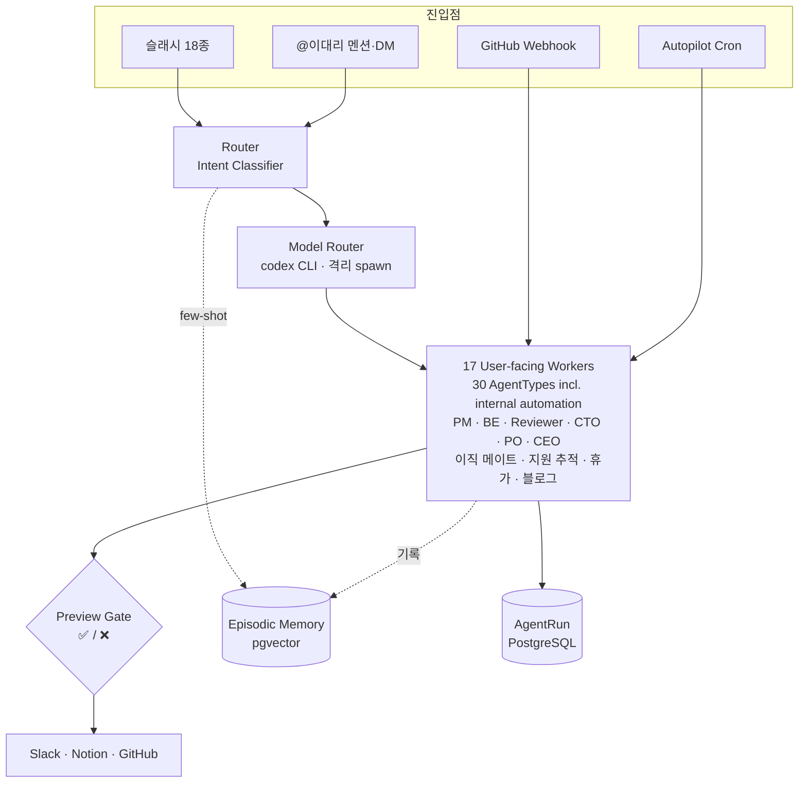

<div align="center">

# 🤖 이대리 · personal_agents

**Slack 에서 PM · BE · 리뷰어 · CTO · PO · CEO 를 1인 개발자가 부리는 멀티 에이전트 업무 자동화 봇**

수동 슬래시 · 자연어 멘션 · GitHub Webhook · 자동 Cron 을 한 백엔드로 묶는다.

[](https://github.com/JSL107/personal_agents/actions)


[무엇을 하나](#-무엇을-하나) · [아키텍처](#-아키텍처) · [만든 것](#-만든-것) · [빠른 시작](#-빠른-시작) · [인터페이스](#-인터페이스) · [설정](#-설정) · [앞으로 만들 것](#-앞으로-만들-것) · [명령어](#-명령어)

</div>

---

## ✨ 무엇을 하나

GitHub · Notion · Slack 을 연결해 **회사 롤플레이 역할**(PM · BE · Code Reviewer · CTO · PO · CEO …)과 **개인 업무**(이직 메이트 · 지원 추적 · 휴가 · 블로그)를 함께 수행하는 1인 개발자용 비서 백엔드.

| | |
|---|---|
| 🗣️ **두 가지 진입** | Slack slash command 18개, 또는 `@이대리 오늘 plan 짜줘` 자연어 멘션·DM |
| 🎭 **회사 롤플레이** | 한 사람이 PM · BE · 리뷰어 · CTO · PO · CEO 역할을 LLM 워커로 분담 |
| ⚡ **자동 발화** | 출근/퇴근/주간 cron + GitHub webhook 으로 사용자 입력 없이 proactive 동작 |
| 🧠 **장기 기억** | 과거 작업을 pgvector 의미검색으로 회상해 분류·리뷰 품질 강화 |
| 🛡️ **승인 게이트** | 외부 시스템 쓰기는 항상 Slack ✅/❌ 확인 후 실행 |

> 자동화 규칙 [AGENTS.md](./AGENTS.md) · 코드 컨벤션 [CODE_RULES.md](./CODE_RULES.md)

---

## 🧩 아키텍처


```mermaid
flowchart TD
    subgraph IN["진입점"]
        direction LR
        S["슬래시 18종"]
        M["@이대리 멘션·DM"]
        W["GitHub Webhook"]
        C["Autopilot Cron"]
    end

    R["Router<br/>Intent Classifier"]
    MR["Model Router<br/>codex CLI · 격리 spawn"]
    WK["17 User-facing Workers<br/>30 AgentTypes incl. internal automation<br/>PM · BE · Reviewer · CTO · PO · CEO<br/>이직 메이트 · 지원 추적 · 휴가 · 블로그"]
    PG{"Preview Gate<br/>✅ / ❌"}
    EXT["Slack · Notion · GitHub"]
    EM[("Episodic Memory<br/>pgvector")]
    AR[("AgentRun<br/>PostgreSQL")]

    S --> R
    M --> R
    R -. few-shot .-> EM
    R --> MR --> WK
    W --> WK
    C --> WK
    WK --> PG --> EXT
    WK --> AR
    WK -. 기록 .-> EM
```

도메인마다 같은 DDD/Hexagonal 레이어를 쓴다.

```
src/{domain}/
  domain/         # 엔티티, Port 인터페이스, 도메인 검증
  application/    # 유스케이스
  infrastructure/ # Port 어댑터 (DB · 큐 · 외부 API)
  interface/      # Controller, DTO, 큐 Provider
src/common, src/config, src/prisma   # 공통 · env 검증 · PrismaService(Global)
prisma/schema.prisma                 # DB 단일 소스 (14 models)
```

---

## ✅ 만든 것

<table>
<tr><td width="50%" valign="top">

**🏗️ 기반**

NestJS 10 + DDD/Hexagonal · Prisma 6 + PostgreSQL · Redis/BullMQ · Slack Bolt 4(Socket Mode).

**Model Router** 는 모든 에이전트를 `codex`(ChatGPT) CLI 하나로 보낸다. 프롬프트는 argv 가 아닌 stdin 으로 넘겨 `ps aux` 노출을 막는다.

모든 실행은 **AgentRun** 에 기록되고 근거는 EvidenceRecord 로 따라붙는다. 외부 쓰기는 **Preview Gate** 하나가 공통으로 승인을 받는다.

</td><td width="50%" valign="top">

**🧠 장기 기억 (Episodic Memory)**

과거 작업을 pgvector 로 의미 검색하고, 오래된 기록일수록 점수를 낮춘다(`@huggingface/transformers`, Xenova/multilingual-e5-small 384dim).

쓰는 곳은 둘이다. **Intent Classifier** 는 비슷한 과거 작업을 예시로 앞에 붙여 분류 정확도를 올린다. **Code Reviewer** 는 `/review-feedback ... reject` 로 기각당한 리뷰를 "이렇게 하지 말라"는 예시로 쌓아 다음 리뷰 프롬프트에 넣는다.

</td></tr>
<tr><td width="50%" valign="top">

**⚡ 자동화 (Autopilot)**

출근·퇴근·주간 cron 이 엔진 하나를 공유한다. 무엇을 언제 돌릴지는 선언형 "워크데이 플레이북"에 적고, 오케스트레이터는 그 선언을 실행만 한다([시간표](#-인터페이스)).

읽기 작업은 바로 발송하고 외부 쓰기는 Preview Gate 를 거친다. 여러 대상에 fan-out 하거나 한 묶음(digest)으로 보낼 수 있고, 같은 날 두 번 돌아도 결과가 같으며, 활동이 0 이면 건너뛴다. 전체 on/off 는 `AUTOPILOT_OWNER_SLACK_USER_ID` 한 값.

</td><td width="50%" valign="top">

**🔀 자연어 라우터 (V3 Hierarchical Manager)**

멘션 하나가 워커에 닿기까지 LLM 호출은 한 번뿐이다. Intent Classifier 가 의도를 분류해 17개 워커 중 하나로 넘긴다.

직전 대화를 기억한다 — 사용자·채널·스레드 단위로 5턴, TTL 30분(Redis, 실패 시 in-memory fallback). 그래서 "그거 분배해" 같은 지시대명사가 직전 실행을 자동으로 가리킨다.

워커끼리 넘긴 기록은 `AgentRun.parentId` 로 남아 체인 전체를 추적할 수 있다.

</td></tr>
</table>

**🎭 에이전트**

전체 AgentType 은 내부 자동화까지 포함해 30종이다. 최신 표는 자동 생성 문서 [docs/agent-catalog.md](./docs/agent-catalog.md) 가 기준이고, 아래는 사용자가 직접 체감하는 것만 추린 것이다.

- **회사 롤플레이** — PM `/today` · Work Reviewer `/worklog` · Code Reviewer `/review-pr` · BE `/be plan` · PO Shadow `/po-shadow` · Impact Reporter `/impact-report` · CTO `/assign` · PO_EVAL `/po-eval` · CEO `/ceo-review`
- **BE 자율 4종** — `/be schema`(Prisma 스키마 제안) · `/be test`(tree-sitter AST 기반 Jest 생성) · `/be sre`(스택트레이스 분석) · BE-FIX(PR 컨벤션) — BE-FIX 는 webhook 자동
- **체인 / 승인형 실행** — `/auto-flow` PM → CTO → BE 1-shot, BE sandbox apply/test, 성공 후 사용자 승인 기반 branch + commit + PR open preview
- **개인 업무** — 이직 메이트(merged PR 합성 → 역량 프로필 → 이력서/포트폴리오, JD 갭 분석) · 지원 추적 CRM(등록/상태/넛지 cron) · 휴가 `/휴가`(입사일 기반 결정론 계산) · 블로그 릴레이(Hermes `tistory-blog` 스킬 → Notion 초안)
- **내부 자동화** — Humanizer · Subconscious Gate · Contradiction Judge · Docs Audit Optimizer/Evaluator · Preference Learning · Evening Retro Publish

**🔌 외부 연동**

- **GitHub** — issue/PR 이벤트를 webhook 으로 받아 자동 발화 ([이벤트별 매핑](#-인터페이스))
- **Notion** — Daily Plan append · PR careerLog 일별 자식 페이지 누적 · 📌 reaction → to-do 적재
- **운영** — `/search-runs`(성공 run ILIKE 검색) · `/retry-run`(실패 run 재실행) · docs-sync-audit · 인증/cron 실패 owner DM 알림

---

## 🚀 빠른 시작

```bash
pnpm install          # Prisma Client 생성 (DATABASE_URL 불필요)
cp .env.example .env  # 부팅 전 필수
pnpm db:up            # PostgreSQL(5434) + Redis(6381) 컨테이너 기동
pnpm db:push          # 스키마 동기화 (synchronize, 마이그레이션 파일 X)
pnpm dev              # watch 모드 기동
```

> **사전 요구사항** — Node 22+, pnpm 9+, Docker, 로그인된 `codex` CLI(ChatGPT). CLI 는 prompt-injection 방지를 위해 임시 디렉토리 + env allowlist 로 격리 실행한다([cli-process.util.ts](src/model-router/infrastructure/cli-process.util.ts)).
>
> **검증** — `pnpm lint:check && pnpm test && pnpm build` 3중 green.

---

## 🔌 인터페이스

| 진입 | 무엇 | 인증·게이트 |
|---|---|---|
| **슬래시 커맨드** | 18종 (에이전트 호출 · 휴가 · 운영) | Slack Socket Mode |
| **자연어 멘션·DM** | Router 가 17개 워커 중 하나로 분류·dispatch | `app_mention` + `message.im` 구독 |
| **GitHub Webhook** | issue/PR 이벤트로 자동 발화 | HMAC 서명 검증 |
| **Autopilot cron** | 출근·퇴근·주간 정기 실행 | `AUTOPILOT_OWNER_SLACK_USER_ID` |
| **macOS 콘솔 앱** | Slack 없이 회사 전체를 보고 조작 | `CONSOLE_OWNER_SLACK_USER_ID` |

<details>
<summary><b>슬래시 커맨드 18개</b></summary>

<br>

| Command | 설명 | 모델 |
|---|---|:---:|
| `/today` `/worklog` `/po-shadow` `/impact-report` `/review-pr` `/be <plan\|schema\|test\|sre>` `/assign` `/po-eval` `/ceo-review` `/auto-flow` | 전체 에이전트 (계획 · 회고 · PR 리뷰 · BE · CTO · PO · CEO · 체인) | 🟢 ChatGPT(codex) |
| `/휴가` | 연차 계산 / 등록 / 취소 (결정론, LLM 미사용) | ⚪ — |
| `/sync-plan` `/sync-context` `/quota` `/ping` `/retry-run` `/search-runs` `/review-feedback` | 동기화 · 운영 · 검색 · 피드백 | ⚪ — |

> BE-FIX 는 슬래시가 없다. GitHub webhook 으로만 발화하고, 수동 재실행은 `/retry-run <AgentRun ID>`.

</details>

<details>
<summary><b>자연어 멘션 · DM</b></summary>

<br>

`@이대리 …`(채널) 또는 DM 으로 보내면 Router 가 17개 워커 중 하나로 분류해 dispatch 한다. 결과는 thread 답글로 오고 푸터에 `agentRunId` 가 붙는다.

- **BLOG · 이직 메이트 · 지원 추적** — 자연어 전용 (슬래시 없음)
- **VACATION** — `/휴가` 와 자연어 둘 다 지원

Slack 설정: Event Subscriptions 에 `app_mention` + `message.im`, Bot scope 에 `app_mentions:read` + `im:history`.

</details>

<details>
<summary><b>GitHub Webhook</b> (<code>POST /v1/agent/github</code> · <code>/v1/agent/trigger</code>)</summary>

<br>

`/github` 는 `X-Hub-Signature-256`(`GITHUB_WEBHOOK_SECRET`) 으로, `/trigger` 는 자체 HMAC(`WEBHOOK_SECRET`) 으로 검증한다. `GITHUB_WEBHOOK_DEFAULT_SLACK_USER_ID` 가 없으면 200 OK 만 반환하고 자동 발화는 건너뛴다.

| 이벤트 | 발화 | 추가 활성 env |
|---|---|---|
| `issues.opened` | Impact Reporter / Auto-Label | `GITHUB_ISSUE_AUTO_LABEL_ENABLED` |
| `pull_request.opened` | Impact Reporter / BE-FIX / (조건부) Code Reviewer | `GITHUB_WEBHOOK_OWNER_LOGIN` |
| `pull_request.closed` (merged) | PR careerLog → Notion | `PR_CAREERLOG_AUTO_ENABLED` + `CAREER_LOG_NOTION_PAGE_ID` |

</details>

<details>
<summary><b>Autopilot cron 시간표</b> (항목별 timezone)</summary>

<br>

`AUTOPILOT_OWNER_SLACK_USER_ID` 한 값으로 전체가 켜지고, 없으면 전부 비활성이다.

| 시간 | 동작 |
|---|---|
| 🌅 매일 08:30 | 비서실(하루 한 장 결산) + Morning Briefing (PM `/today` 자동 계획) — digest 1메시지 |
| 🌆 매일 19:00 | Daily Eval(PO_EVAL) + Worklog — digest 1메시지 |
| 📅 금 17:00 | Weekly Summary (Worklog 1주 + CEO meta) |
| 📅 일 10:00~12:00 | Knowledge-Lint · Docs Audit · Preference Learning |
| 📅 일 18:00 | CEO Meta |
| 📅 월 09:00 | Run-Retro (주간 실행 통계 회고) |
| 📅 토 09:00 | Impact Report (`--recent`, 본인 머지 PR 종합) |
| 🗂️ 금 19:00 | AI CLI 환경 스냅샷 내보내기 (sync repo 설정 시) |
| 🗂️ 매일 10:00 | 다른 PC의 AI CLI 환경 스냅샷 감지·승인 카드 생성 (sync repo 설정 시) |
| 🇰🇷 평일 17:10 KST | 국내 보유 종목 모니터링 |
| 🇺🇸 평일 16:30 ET | 미국 보유 종목 모니터링 |

> 스케줄·타임존은 `AUTOPILOT_<ID>_SCHEDULE` / `_TIMEZONE` 으로 덮어쓴다. 여기서 `<ID>` 는 **그룹명이 아니라 그룹의 첫 항목 id** 다(morning 그룹은 `SECRETARIAT`, noon 그룹은 `ASSIGN`). 플레이북 선언은 [autopilot.playbook.ts](src/autopilot/domain/autopilot.playbook.ts).

</details>

<details>
<summary><b>macOS 콘솔 앱</b> (<a href="clients/idaeri-console">clients/idaeri-console</a>)</summary>

<br>

Slack 없이 회사 전체를 눈으로 보고 조작하는 네이티브 관제 앱(Swift ~5.8k 줄, SwiftUI + SpriteKit). Xcode 프로젝트 없이 Swift Package 로 빌드한다.

| 탭 | 내용 |
|---|---|
| 대시보드 | 에이전트 27종 상태 카드 · 최근 run · 승인 대기 · 로컬 CLI 세션 |
| 오피스 | 부서 6개 방으로 나뉜 픽셀 사무실 — 상태는 발밑 링, 진행은 몸짓(타이핑·엎드림·줄서기)으로 |

- **읽기** — `GET /v1/console/{snapshot,agents,runs,approvals}` + `GET /v1/console/stream`(SSE) 로 실시간 반영
- **쓰기** — `POST /v1/console/command`(지시) · `approvals/:id/{apply,cancel}`(승인·거절) · `sessions/:sessionId/inject`(유휴 CLI 세션에 작업 주입). 기존 dispatch·PreviewGate usecase 에 위임하므로 Slack 경로와 판정이 갈리지 않는다. `CONSOLE_OWNER_SLACK_USER_ID` 가 없으면 쓰기는 503 으로 막힌다.
- 앱 안에는 지능 로직을 두지 않는다. 상태 판정은 전부 백엔드가 하고 앱은 표시·조작만 한다.

```bash
cd clients/idaeri-console
swift build
IDAERI_CONSOLE_URL=http://127.0.0.1:3002 swift run IdaeriConsole
swift run ConsoleCoreTests    # CLT 환경이라 XCTest 가 아닌 실행형 러너
```

</details>

---

## 🔧 설정

<details>
<summary><b>환경변수</b></summary>

<br>

단일 source-of-truth 는 [app.config.ts](src/config/app.config.ts) 의 `EnvironmentVariables` (class-validator 강제). **전체 124개 목록은 자동 생성 문서 [docs/env-catalog.md](./docs/env-catalog.md)** 에 있고 `pnpm docs:sync` 로 갱신한다. `.env.example` 동기 확인은 `pnpm check:env`.

아래는 처음 띄울 때 실제로 만지는 것만 추렸다.

| 키 | 필수 | 설명 |
|---|:---:|---|
| `DATABASE_URL` · `REDIS_HOST` / `REDIS_PORT` | ✅ | PostgreSQL(5434) · Redis(6381) |
| `SLACK_BOT_TOKEN` / `_APP_TOKEN` / `_SIGNING_SECRET` | ⭕ | 3개 모두 있어야 봇 활성 (Socket Mode) |
| `GITHUB_TOKEN` · `NOTION_TOKEN` / `NOTION_TASK_DB_IDS` | ⭕ | 미설정 시 해당 연동 skip |
| `*_WEBHOOK_SECRET` · `GITHUB_WEBHOOK_*` | ⭕ | webhook 검증 · 자동 발화 가드 |
| `AUTOPILOT_OWNER_SLACK_USER_ID` · `AUTOPILOT_TARGET` | ⭕ | cron 전체 게이트 · 발송 대상(콤마 다중) |
| `CONSOLE_OWNER_SLACK_USER_ID` | ❌ | 콘솔 지시·승인 주체 — 없으면 콘솔 쓰기 503 |
| `CAREER_LOG_NOTION_PAGE_ID` · `CAREER_*_NOTION_PAGE_ID` | ⭕ | careerLog · 이력서/포트폴리오 Notion 적재 대상 |
| `EPISODIC_EMBED_MODEL` / `_DIM` | ❌ | 임베딩 모델·차원 (기본 384dim) |

**기본 OFF 인 기능 스위치** — `'true'` 로 켠다. `STOCK_MONITOR_ENABLED`(보유 종목 모니터링) · `PAPER_TRADING_ENABLED`(모의투자 평가) · `SCREENER_ENABLED`(KRX 유니버스·시세 수집) · `SUBCONSCIOUS_ENABLED`(proactive engine) · `PR_REVIEW_LOOP_ENABLED`(PR 리뷰 스윕) · `AUTOPILOT_PREFERENCE_LEARNING_ENABLED`(주간 선호 학습) · `PREFERENCE_PROFILE_INJECTION_ENABLED`(학습 프로필 주입).

**기본 ON 이라 끌 때만 만지는 것** — `'false'` 로 끈다. `HUMANIZE_REPORTS_ENABLED`(보고서 자동 윤문) · `BRIEFING_WAITING_SECTION_ENABLED`(아침 브리핑 PR 분류 섹션) · `EVENING_RETRO_PUBLISH_ENABLED`(저녁 회고 발행 후보) · `AUTOPILOT_KNOWLEDGE_LINT_L4_ENABLED`(모순 판정).

**Model provider** — 전체 에이전트가 ChatGPT(Codex CLI) 단일 provider 다. provider 간 fallback 은 없다. codex 가 실패하면 재시도 없이 즉시 실패하고, 쿼터가 소진된 경우 reset 시각을 안내한다. `ClaudeCliProvider` 와 `CLAUDE_CODE_OAUTH_TOKEN` 인증 경로는 롤백 대비로 코드만 남아 있고 현재 호출되는 경로는 없다.

</details>

<details>
<summary><b>Slack 봇 최초 설정</b></summary>

<br>

1. [api.slack.com/apps](https://api.slack.com/apps) 에서 앱 생성 → **Socket Mode** 활성화 → App-Level Token(`connections:write`) = `SLACK_APP_TOKEN`
2. **OAuth & Permissions** → Bot Token Scopes 에 `commands` `chat:write` `app_mentions:read` `im:history` → install → Bot Token = `SLACK_BOT_TOKEN`
3. **Basic Information** → Signing Secret = `SLACK_SIGNING_SECRET`
4. **Slash Commands** 에 18종 등록 (또는 **App Manifest** 의 `slash_commands` 배열로 일괄 선언 후 Reinstall)
5. **Event Subscriptions** → `app_mention` + `message.im` 구독 → Reinstall
6. `.env` 채운 뒤 `pnpm dev` → `이대리 Slack 봇이 Socket Mode 로 기동되었습니다.` 로그 확인

> Socket Mode 라 Request URL 은 불필요(UI 가 요구하면 더미 값). 채널 멘션만/DM만 필요하면 해당 이벤트만 켜도 된다.

</details>

<details>
<summary><b>다른 PC 로 옮기기 — Claude Code · Codex 개인 환경</b></summary>

<br>

이대리 본체와는 별개로, 이 PC 의 AI CLI 환경(플러그인 · MCP · skills · agents · commands · rules · hooks)을 새 PC 에서 재현하는 스크립트다. Claude Code(`~/.claude`) 와 Codex(`~/.codex`) 를 함께 다루고, 설치돼 있지 않은 쪽은 자동으로 건너뛴다.

```bash
node scripts/export-ai-cli-env.cjs ./ai-cli-env-export   # 기존 PC 에서 내보내기
# ai-cli-env-export 디렉터리를 새 PC 로 옮긴 뒤
node scripts/bootstrap-ai-cli-env.cjs ./ai-cli-env-export --dry-run   # 무엇이 바뀌는지 먼저 확인
node scripts/bootstrap-ai-cli-env.cjs ./ai-cli-env-export             # 적용
```

| 도구 | 옮기는 것 | 복원 방법 |
|---|---|---|
| Claude Code | 마켓플레이스 · 활성 플러그인 · MCP · `skills` `agents` `commands` `hooks` | `claude plugin marketplace add` → `plugin install` → `mcp add-json` |
| Codex | 마켓플레이스 · 플러그인 · MCP · `agents` `skills` `rules` `AGENTS.md` | `codex plugin marketplace add` → `plugin add` → `mcp add` |

**안 옮기는 것** — 비밀값(MCP 의 `env`·`headers` 는 키 이름과 무관하게 전부 플레이스홀더로 빠진다), 인증 파일과 대화 기록(`~/.codex/auth.json`, `sessions/`, `memories/`, `~/.claude/projects/`), 이 PC 에서만 유효한 것(로컬 경로 마켓플레이스, 데스크톱 앱이 주입한 MCP). 그래서 Codex 홈이 3GB 를 넘어도 실제로 옮기는 자산은 수 MB 다. 무엇을 뺐는지는 실행할 때 목록으로 보여준다.

**새 PC 에서 할 일** — 빠진 환경 변수를 export 하고 대화형 인증(Notion OAuth, `codex login` 등)을 마친다. 필요한 목록은 산출물의 `SECRETS-TODO.md` 에 있다. 없는 채로 두면 그 MCP 만 건너뛰고 알린다.

**hooks 는 매 세션 실행되는 코드라 따로 취급한다.** `--with-hooks` 를 붙일 때만 적용하고, 대상 PC 에 이미 hooks 가 있으면 `--replace-hooks` 없이는 건너뛴다(hooks 는 통째로 교체되는 값이라 기존 훅이 즉시 꺼진다). `permissions`·`defaultMode` 는 옮기지 않는다. 심볼릭 링크는 실체로 풀어서 복사하고(링크 그대로 옮기면 새 PC 에서 전부 끊어진다), 명령 안의 옛 홈 경로는 새 PC 홈으로 치환한다.

</details>

---

## 🔭 앞으로 만들 것

- [ ] **토론 모드** — 멀티 에이전트가 한 주제로 의견을 교환·반박하며 합의안을 도출 (현재 단일 워커 dispatch → 다자 debate 로 확장)
- [ ] **BE 자율 개발 hardening** — 승인형 sandbox apply/test + PR open preview 는 구현됨. 남은 과제는 실패 시 self-correction retry, 더 넓은 repo/테스트 매트릭스, 운영 가드 강화
- [ ] **운영 전환** — `prisma db push`(synchronize) → `prisma migrate dev` 마이그레이션 워크플로우

---

## 🧰 명령어

```bash
pnpm dev | start | start:prod                  # 개발 watch | 실행 | 프로덕션
pnpm db:up | db:down | db:push | db:studio     # 로컬 DB/Redis · 스키마 반영 · Studio
pnpm build | test | test:e2e | lint:check | format:check
pnpm docs:sync | docs:check | check:env        # 자동 생성 문서 갱신 · 검사 · .env 동기 확인
```

> **DB 변경**: `prisma/schema.prisma` 수정 → `pnpm db:push`(synchronize, Prisma Client 자동 재생성) → 앱 재시작.

---

## 📚 참고 문서

- [자동화 규칙 (AGENTS.md)](./AGENTS.md) · [코드 규칙 (CODE_RULES.md)](./CODE_RULES.md)
- 자동 생성 — [에이전트 카탈로그](./docs/agent-catalog.md) · [환경변수 카탈로그](./docs/env-catalog.md)
- 진행 기록 [docs/superpowers/plans/](./docs/superpowers/plans/) · [과거 설계/기획 archive](./docs/archive/)
